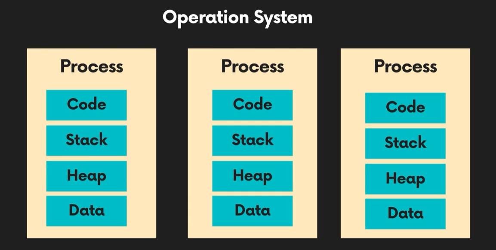

### 1. Project name: Learning Event loop

### 2. Period : 1 day

### 3. Concept of event loop

#### 3-1. Data structure

- Operation System(OS) could have several process. The process is program executed continuously on assigned memory of the OS. The process also has code, stack, heap, data. The code means the code for booting program. The stack contains to have not only sequence of executing functions but also destination of return when last function is finished on callstack. Each of treads executes according to the assigned stack. However, each of treads should use code, heap, data of porcess because each of treads are included on the process. The heap means a storage space which saved defined variables such as number, string, object. The variables are just defined on heap without data structure.

- 
  

#### 3-2. Browser with javascript

- Javascript is single thread. However, browser could operate processes like multi thread using Web-APIs. For example, `setTimeout()` is moved from `call stack` to `taks queue` using Web API.

- 
  

- Call stack is LIFO. LIFO is last in first out. Task queue is FIFO. FIFO is first in fisrt out. `add()` and `remove()` are representative Web-API of queue. `Event loop` is checking call stack and task queue. The one of functions of `task queue` would be moved to `call stack` by `Event loop` when call stack is empty completely. Microtask queue would called at first. `Event loop` is operating on Microtask queue until all of functions are executed and finished completely. In contrast, `Event loop` would operate on task queue until one of function is executed and finished. And then, `Event loop` would update and check functions of `render`. `Event loop` will finally operate with cycling the sequence. The sequence is `microtask queue`, `task queue`, `render`.

- 
  
