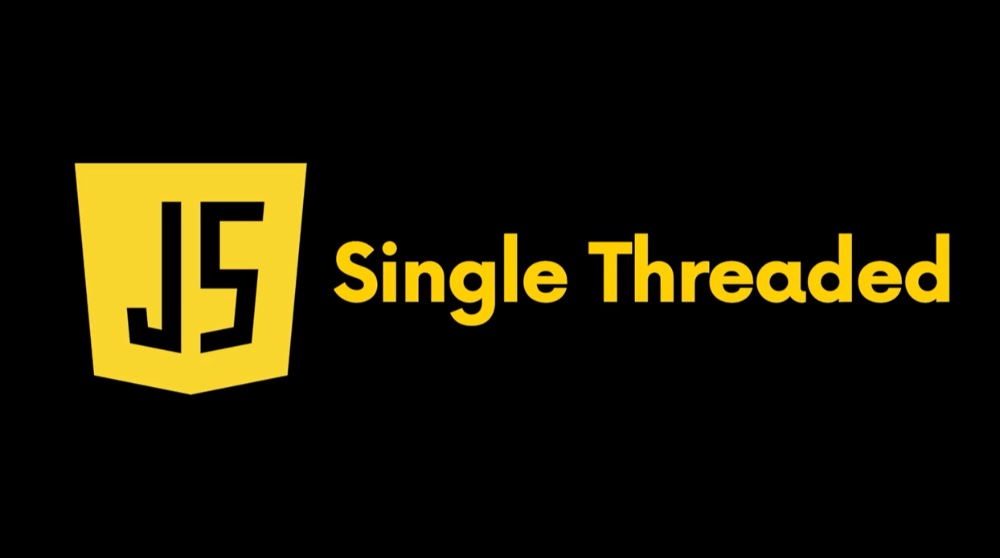

### 1. Project name: Learning Event loop

### 2. Period : 1 day

### 3. Concept of event loop

#### 3-1. Data structure

- Operation System(OS) could have several process. The process is program executed continuously on assigned memory of the OS. In case one of process has malfunction, each of processes operates independently. Some of processes would have malfunction if the processes are related to malfunctioned process. The process also has code, stack, heap, data. The code means the code for booting program. The stack contains to have not only sequence of executing functions but also destination of return when last function is finished on callstack. Each of treads would executes according to the assigned stack. The tread has assigned stack because they should remember calling from process with stack to execute their functions correctly. However, each of treads should use code, heap, data of porcess because common resources are within process such as code, heap, data. Each of treads are also included on the process. Their goal is to operate process correctly. The heap means a storage space which saved defined variables such as number, string, object. The variables are just defined on heap without data structure.

- 
  

#### 3-2. Browser with javascript

- Javascript is single thread. However, browser could operate processes like multi thread using Web-APIs. For example, `setTimeout()` is moved from `task queue` to `call stack` using Web API after `microtask queue` is finished.

- 
  

- Call stack is LIFO. LIFO is last in first out. Task queue is FIFO. FIFO is first in fisrt out. `add()` and `remove()` are representative Web-API of queue. `Event loop` is checking `call stack`, `microtask queue`, `task queue` and `render`. The only one callback function would be moved from `microtask queue` or `task queue` to `call stack` by `Event loop` when call stack is empty completely. `microtask queue` has higher priority than `task queue`. So, `microtask queue` would be called by `Event loop` on call stack at first. `Event loop` is operating with while loop. `Event loop` is checking between `queue` and `call stack`. In case of `microtask queue`, callback functions could operate without switching to `task queue` until all of callback functions are executed and finished completely. In contrast, `Event loop` would operate on task queue until one of function is executed and finished. And then, `Event loop` would update and check functions of `render`. `Event loop` will finally operate with cycling the sequence. The sequence is `microtask queue`, `task queue`, `render`. `render` means to update display with render elements such as tree, layout, paint.

- Callback function could has functions. The functions within one of callback function would be operated together at the same time regardless of sequence of the functions. `Event loop` will apply updated functions to `render` when callback function is finished and `call stack` is empty. For example, in case of operating `addEventListener`, `Event loop` will wait until `addEventListener` is finished and call stack is empty. All functions within `addEventListener` would be ready to update on `call stack` during the wating time. And then, `Event loop` will update revised functions within `addEventListener` together to `render` at the same time. So, no matter where functions is positioned with sequence. In addition, in case of `task queue`, `Event loop` maybe update revised callback function to `render` with cycling routine repeatedly during the certain period of time. If callback function has infinite loop, some of updates are applied to by javascript engine during the infinite loop. In contrast, in case of `microtask queue`, `Event loop` would wait continueously without updating `render` until `microtask queue` is finished and it is empty.

- 
  

### 4. Demo of Event loop

- In case you want to make application which moves coordinate when clicking button, use toggle rather than type functions within callback function.

#### 4-1. Insert only commands within callback function

- Output maybe is that box would move to 500px at first according to X axis. And then, box would be stopped because last command is `box.style.transform = 'translateX(500px)';`.
  `box.style.transform = 'translateX(800px)';` can not be operated because `box.style.transform = 'translateX(500px)';` is rewritten after `box.style.transform = 'translateX(800px)';`. In case of different value on same element, `Event loop` updates last command.

- ``

- 

#### 4-2. Add toggle within callback function

- Please control output with switch type of input because condition exists only two type. First, move to 800px along with X axis. Second, move to 500px. So, toggle would be better.

- ``

- 
